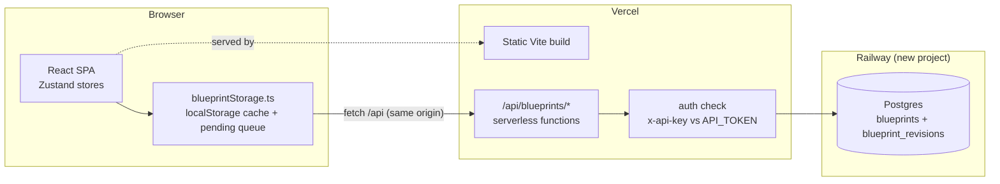

# feat: Persist blueprints in Railway Postgres and deploy to Vercel

## Summary

Give the Agent Blueprint Builder durable, hosted storage: a new Postgres database on Nick's existing Railway account (new project, separate from layer-up) holds blueprints and their revision history, fronted by a thin API deployed as Vercel serverless functions in this same repo. The client's existing two-tier storage (localStorage cache + background sync) swaps its remote provider from Supabase to the new API. The app deploys to Vercel (static SPA + `/api` functions) so it is reachable beyond localhost.

## Problem Frame

Blueprints currently live in browser localStorage with an optional Supabase background sync that is not provisioned in Nick's own infrastructure. Nick wants blueprints (and related data) stored in a database he controls on Railway, and the app hosted on Vercel so it's accessible off his machine. The storage abstraction (`src/services/blueprintStorage.ts`) already isolates the remote provider behind `loadAll` / `save` / `remove` / `syncPending` with a `SyncStatus` contract consumed by the Header sync indicator — this plan swaps what's behind that seam and adds the deployment story.

---

## Requirements

**Persistence**
- R1. Blueprints persist to a Railway-hosted Postgres database and are retrievable from any browser/device pointed at the deployed app.
- R2. List, load, save (upsert), and delete operate through the API; the editor's existing 1s-debounce auto-save path is unchanged from the store's perspective.
- R3. Every server-side save records a revision in a history table, capped at the 20 most recent per blueprint (older rows pruned on write).

**Resilience & compatibility**
- R4. Degraded behavior is preserved: with no API configured the app runs in `offline` mode from localStorage; API failures mark items `pending` and `syncPending` retries them; the Header sync dot's four states (`synced`/`pending`/`offline`/`error`) remain accurate.
- R5. Blueprints already in localStorage reach the server without manual export/import (the existing pending-queue path uploads them on first successful sync).
- R6. Local dev (`npm run dev`) keeps working with zero configuration (offline mode).

**Access control**
- R7. When an `API_TOKEN` env var is set on the deployment, every API route requires a matching `x-api-key` header; the client sends a token the user enters once in a settings dialog (stored in localStorage). With no `API_TOKEN` set, auth is skipped (local dev).

**Deployment**
- R8. The app deploys to Vercel from this repo: static Vite build + serverless functions under `api/`, with SPA rewrites so deep links like `/blueprint/:id` survive refresh.
- R9. Database schema is applied via a repeatable migration command (`npm run db:migrate`) that is safe to re-run (tracks applied migrations).

---

## Key Technical Decisions

- **API as Vercel serverless functions in this repo, not a separate Railway web service.** One deployable, same-origin `/api/*` (no CORS), no second service to operate. Railway hosts only Postgres. Rationale: the API surface is 4 small endpoints; a standalone server adds an extra deploy target for no benefit at this scale.
- **Keep the two-tier storage design; swap only the remote provider.** `src/services/blueprintStorage.ts` keeps its public contract (`loadAll`/`save`/`remove`/`syncPending`, `SyncStatus`); `src/lib/supabase*.ts` is replaced by `src/lib/apiBlueprints.ts`. Zustand stores, Header, and auto-save remain untouched. Supabase dependency and `src/utils/migrateToSupabase.ts` are removed — this is a replacement, not a dual backend.
- **Schema mirrors the proven Supabase layout: metadata columns + JSONB document columns** (`nodes`, `edges`, `comments`, `parking_lot`, `change_log` as JSONB), plus a new `blueprint_revisions` table. Queryable metadata without normalizing the node graph into relational tables — the blueprint is a document; the app is its editor.
- **Shared-secret auth (`x-api-key` vs `API_TOKEN` env), not user accounts.** Single-user tool today; the token gates the public deployment. Client-side token entry reuses the app's existing localStorage-credential pattern (same as the Claude API key). Documented limitation: anyone with the token has full access; no per-user data.
- **`pg` Pool created at module scope in the function runtime, small `max`, SSL enabled.** Vercel reuses warm invocations; a module-level pool avoids per-request connections. Railway public connection strings require TLS (`ssl: { rejectUnauthorized: false }`).
- **Plain-SQL migrations with a tiny Node runner** (`db/migrations/NNN_*.sql` + `scripts/db-migrate.mjs`, tracked in a `schema_migrations` table). No ORM/migration framework — two tables don't justify one.
- **Server code lives in `server/` with thin `api/` wrappers.** Vercel requires handlers under `api/`; keeping logic (validation, row mapping, revision pruning, auth check) in `server/` makes it unit-testable. Vitest `include` extended to cover `server/**`, with `@vitest-environment node` on server tests (default env is jsdom).

---

## High-Level Technical Design

Save flow (unchanged client contract): editor change → store auto-save (1s debounce) → `blueprintStorage.save()` writes localStorage immediately → `PUT /api/blueprints/:id` → on success `synced`, on failure id added to pending queue (`pending`) and retried by `syncPending()`; server upserts the row and inserts a capped revision.

---

## Implementation Units

### U1. Database schema and migration tooling

**Goal:** A repeatable way to create/evolve the Railway Postgres schema.
**Requirements:** R1, R3, R9
**Dependencies:** none
**Files:** `db/migrations/001_init.sql`, `scripts/db-migrate.mjs`, `package.json` (script `db:migrate`, deps `pg`), `.env.example`
**Approach:** `001_init.sql` creates `blueprints` (same columns as the existing `supabase/schema.sql`: metadata columns + JSONB `nodes`/`edges`/`comments`/`parking_lot`/`change_log`, `updated_at` trigger, index on `last_modified_date desc`) and `blueprint_revisions` (`id bigserial`, `blueprint_id uuid` FK cascade, `data jsonb`, `saved_at timestamptz`, index on `(blueprint_id, saved_at desc)`). No RLS (not Supabase). The runner connects via `DATABASE_URL`, creates `schema_migrations(name, applied_at)` if absent, applies unapplied `db/migrations/*.sql` in filename order inside transactions. Core logic (list → diff applied → order) extracted as a pure function.
**Patterns to follow:** column layout from `supabase/schema.sql`.
**Test scenarios:** (in `scripts/db-migrate.test.mjs` or `src`-adjacent per vitest include)
- Pure planner: given files `[002_x.sql, 001_a.sql]` and applied `[001_a.sql]` → returns `[002_x.sql]` (ordering + diffing).
- Given no applied migrations → returns all in ascending filename order.
- Given all applied → returns empty list (idempotent re-run).
**Verification:** `npm run db:migrate` against a real `DATABASE_URL` applies cleanly twice in a row (second run is a no-op) — exercised for real in U6.

### U2. Serverless API: blueprints CRUD, revisions, health, auth

**Goal:** The hosted persistence API the client talks to.
**Requirements:** R1, R2, R3, R7
**Dependencies:** U1
**Files:** `api/blueprints/index.ts` (GET list), `api/blueprints/[id].ts` (GET/PUT/DELETE), `api/health.ts`, `server/db.ts` (pool), `server/auth.ts`, `server/blueprints.ts` (validation + row↔blueprint mapping + revision insert/prune), `server/blueprints.test.ts`, `vitest.config.ts` (include `server/**`), `package.json` (dev dep `@vercel/node`)
**Approach:**
- `GET /api/blueprints` → summaries only (id, title, description, status, version, node count, last_modified_date) — the list page doesn't need full documents. `GET /api/blueprints/:id` → full blueprint JSON reassembled from the row. `PUT` upserts from a full blueprint body (client-generated UUID ids, as today), inserts a revision, prunes beyond 20. `DELETE` removes (revisions cascade). `GET /api/health` → `select 1` + `{ ok, migrated }`.
- Validation before write: same shape check philosophy as `src/utils/import.ts` — id/title present, nodes/edges arrays, every node has `id`, `type === data.nodeType`, `nodeType` in the 10-type allowlist. Reject oversized bodies (> 2 MB) with 413.
- `server/auth.ts`: if `process.env.API_TOKEN` is set, compare against `x-api-key` (timing-safe compare); 401 on mismatch. Applied in every handler.
**Patterns to follow:** node-type allowlist from `src/utils/import.ts`; column mapping from `src/lib/supabaseBlueprints.ts` (read it before writing the mapper — it already maps camelCase↔snake_case).
**Test scenarios:** (mock `pg` at module boundary; `@vitest-environment node`)
- Mapping round-trip: a full Blueprint (including agentic node types) → row → Blueprint equals input.
- Summary mapping: row → summary contains node count and excludes `nodes`/`edges`.
- Validation rejects: missing id, `type !== data.nodeType`, unknown `nodeType`, non-array `edges` — each returns a 400-shaped error.
- Auth: `API_TOKEN` set + wrong/missing header → 401; matching header → passes; `API_TOKEN` unset → passes.
- Revision prune: with 20 existing revisions, a save issues a delete of rows beyond the newest 20 for that blueprint id.
**Verification:** `npx tsc -b` clean; unit tests green; endpoints exercised live in U6.

### U3. Client storage provider swap (Supabase → API)

**Goal:** The app syncs through the new API with identical offline/pending semantics.
**Requirements:** R1, R2, R4, R5, R6
**Dependencies:** U2 (API shape agreed; can be built in parallel against the contract)
**Files:** `src/lib/apiBlueprints.ts` (new), `src/lib/apiConfig.ts` (new: base URL + token storage), `src/services/blueprintStorage.ts` (swap imports), delete `src/lib/supabase.ts`, `src/lib/supabaseBlueprints.ts`, `src/utils/migrateToSupabase.ts`; `package.json` (remove `@supabase/supabase-js`), `.env.example` (replace Supabase vars with `VITE_API_BASE_URL` optional override), `src/lib/apiBlueprints.test.ts`, `src/services/blueprintStorage.test.ts` (new)
**Approach:** `apiConfig.ts` resolves the API base: `VITE_API_BASE_URL` if set, else same-origin `/api` when served over http(s); `isApiConfigured()` replaces `isSupabaseConfigured()` (false under `npm run dev` with no override → offline mode, satisfying R6). Token helpers store/read the sync token in localStorage (same base64 pattern as the Claude API key). `apiBlueprints.ts` implements `fetchAllBlueprints` / `fetchBlueprint` / `upsertBlueprint` / `deleteBlueprintRemote` with the `{ data, error }` return shape the storage service already consumes, attaching `x-api-key` when a token exists. Note: `loadAll` currently expects full blueprints from the list call — either keep the list endpoint returning full documents, or (chosen) fetch summaries then hydrate lazily; simplest correct path preserving current behavior: `fetchAllBlueprints` calls list + per-id gets only when the list is small, otherwise returns full docs from a `?full=1` list variant. Decide in implementation; the storage contract is what matters.
**Patterns to follow:** `{ data, error }` result shape in `src/lib/supabaseBlueprints.ts`; credential storage in `src/features/smartImport/hooks/useClaudeApi.ts`.
**Test scenarios:** (mock `fetch`)
- `loadAll` with API unreachable → returns cache, status `error`; with API unconfigured → cache, `offline` (R4, R6).
- `save` success → `synced` and no pending entry; failure → `pending` and id persisted in pending set (R4).
- `syncPending` with 2 pending, one succeeding and one failing → failing id remains pending, status `error`; all succeed → `synced` (R4, R5).
- `x-api-key` header attached when token present; absent otherwise (R7 client side).
- 401 response surfaces as `error` status (not a crash).
**Verification:** existing 32 unit tests remain green; new tests green; `npm run build` clean with Supabase dependency removed.

### U4. Sync settings UI (token entry + connection status)

**Goal:** A place to paste the sync token and see whether the app is connected.
**Requirements:** R7
**Dependencies:** U3
**Files:** `src/components/dialogs/SyncSettingsDialog.tsx` (new), `src/store/uiStore.ts` (add `syncSettings` to `DialogType`), `src/components/layout/Header.tsx` (open dialog from the sync-status dot's context / a small settings entry)
**Approach:** Minimal dialog: explanation line, token input (masked), Save/Clear, and a "Test connection" button hitting `/api/health` and reporting ok/unauthorized/unreachable. Follows `ApiKeySettings` dialog conventions.
**Test scenarios:** Test expectation: none — thin UI wiring over helpers tested in U3 (token storage, health check paths); covered by manual verification in U6.
**Verification:** With a wrong token the dialog reports unauthorized and sync dot shows `error`; with the right token, `synced`.

### U5. Vercel deployment configuration and docs

**Goal:** The repo deploys to Vercel as SPA + functions with one click / one CLI command.
**Requirements:** R8
**Dependencies:** U2 (functions exist)
**Files:** `vercel.json` (new), `docs/deployment.md` (new), `README.md` (short hosted-deployment section pointing at docs), `.env.example`
**Approach:** `vercel.json` with `rewrites`: `/api/(.*)` handled by functions automatically (no rewrite needed — Vercel routes `api/` first), single SPA fallback rewrite `{"source": "/(.*)", "destination": "/index.html"}`; confirm Vite static output auto-detection (framework preset `vite`, output `dist`). `docs/deployment.md` documents: Railway project + Postgres provisioning, getting `DATABASE_URL`, running `npm run db:migrate`, Vercel project link, env vars (`DATABASE_URL`, `API_TOKEN`), deploy, and the token-entry step in the app.
**Test scenarios:** Test expectation: none — configuration; verified by the U6 live deployment (deep-link refresh on `/blueprint/:id` returns the SPA, R8).
**Verification:** `vercel build` (or Vercel's deploy build) succeeds; deep links work on the deployed URL.

### U6. Provision Railway, deploy to Vercel, end-to-end verification

**Goal:** The system is live: database provisioned, schema applied, app deployed, save/load round-trip verified.
**Requirements:** R1, R5, R8, R9 (end-to-end proof of all)
**Dependencies:** U1–U5
**Files:** none beyond env/config produced by the platforms (values recorded in `docs/deployment.md` placeholders, never committed)
**Approach:** Install CLIs (`railway`, `vercel`) if absent. Railway: create a **new project** in Nick's existing account (per request — separate from layer-up), add the Postgres plugin, obtain `DATABASE_URL`, run `npm run db:migrate`. Vercel: link the GitHub repo (`ficodegallo/agent-blueprint-builder`, branch `fresh-look` or `main` after merge), set `DATABASE_URL` + `API_TOKEN` env vars, deploy. Then: open the deployed URL, enter the token in Sync Settings, create a blueprint, verify it appears in `blueprints` table and revision rows accrue; reload from a second browser context to confirm R1; confirm pre-existing local blueprints upload via pending sync (R5).
**Execution note:** Railway and Vercel CLI logins are interactive (browser auth) and account-scoped — this unit requires Nick at the keyboard or pre-provisioned `RAILWAY_TOKEN` / `VERCEL_TOKEN` env vars. If neither is available during implementation, complete everything through U5, and hand off U6 as a documented checklist in `docs/deployment.md` with exact commands.
**Test scenarios:** Test expectation: none — live verification steps enumerated in Approach serve as the acceptance pass.
**Verification:** A blueprint saved on the deployed URL is visible from another device/browser; `GET /api/health` returns ok; migration re-run is a no-op.

---

## Scope Boundaries

**In scope:** the six units above.

**Deferred to Follow-Up Work**
- Real multi-user auth (accounts, per-user blueprints, sharing links) — shared token only for now.
- Moving the browser→Anthropic AI calls behind the new API (would let colleagues use AI features without their own key) — separate effort; the storage API lands the infrastructure it would reuse.
- A revisions UI (browse/restore history) — the data is captured (R3); surfacing it is follow-up.
- Migrating Playwright e2e tests to cover the deployed environment.

**Outside this product's identity**
- Realtime multi-editor collaboration/conflict resolution. Last-write-wins is accepted for a single-user tool; noted in `docs/deployment.md`.

## Assumptions

- Supabase is fully replaced, not kept as an alternate backend (its env vars were the only integration; nothing else in Nick's stack depends on it).
- A **new Railway project** is wanted (the request says "same [account] I've used for layer up but creating a new setup"), not a new service inside the layer-up project.
- Single shared token is acceptable access control for a personal tool exposed on Vercel.
- Blueprint documents stay well under the 2 MB request cap (largest realistic blueprints are tens of KB).

## Risks & Dependencies

- **Interactive CLI auth** (highest schedule risk): Railway/Vercel provisioning cannot be completed headlessly without tokens — mitigated by U6's checklist fallback so code is 100% ready regardless.
- **Serverless + Postgres connections:** bursts of cold starts could exhaust Railway's connection limit. Mitigation: pool `max: 3`, short `idleTimeoutMillis`; at this app's traffic (single user) this is comfortable headroom.
- **Vitest environment split:** server tests need Node env while the suite defaults to jsdom — handled per-file with `@vitest-environment node`; watch for accidental jsdom imports in `server/`.
- **Last-write-wins:** two devices editing the same blueprint can silently overwrite each other (existing behavior with Supabase too). Accepted; revisions (R3) make it recoverable.

## Sources & Research

- `src/services/blueprintStorage.ts` — the seam this plan swaps; its `SyncStatus` contract and pending-queue semantics drive R4/R5.
- `supabase/schema.sql` — column layout reused for the Railway schema.
- `src/lib/supabaseBlueprints.ts` — existing camelCase↔snake_case mapping to mirror in `server/blueprints.ts`.
- `src/utils/import.ts` — node-type allowlist reused for server-side validation.
- `src/features/smartImport/hooks/useClaudeApi.ts` — localStorage credential pattern reused for the sync token.
