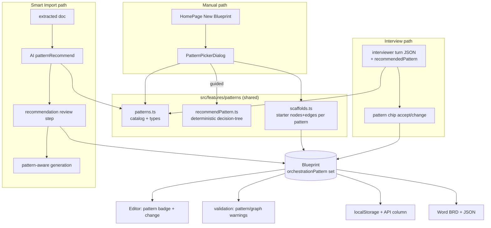

# feat: Pattern-driven blueprint creation

## Summary

Today the six agentic-pattern node types (orchestrator, agent loop, router, parallel, evaluator-optimizer, plus the plain sequential graph) are just templates a user drags onto an otherwise-blank canvas. There is no notion of "this blueprint follows the orchestrator-workers pattern" — the pattern is implicit in whatever nodes happen to be present.

This feature makes the **orchestration pattern a first-class property of a blueprint that is chosen or recommended at creation time**, then used to scaffold the rest of the graph. It threads through all three ways a blueprint is created:

1. **Build manually** — the user picks a pattern (or answers a short guided questionnaire) *before* landing on the canvas; the pattern's starter nodes/edges are scaffolded in.
2. **Upload a doc (Smart Import)** — after extracting the document, the app **recommends** a pattern with rationale; generation is then shaped to that pattern.
3. **Interview** — the Interviewer **infers** a pattern as coverage accumulates and proposes it, shaping the nodes it patches onto the canvas.

The pattern catalog and the selection heuristic are grounded in a deep-research pass on agentic orchestration patterns (see [Research](#research-agentic-orchestration-patterns)). A single shared catalog + recommender backs all three paths so the taxonomy stays consistent.

## Problem Frame

The user's words: *"the agent patterns are things that we slide into the blueprint canvas. What I really want is when you go to create a blueprint, I pick the pattern, or when I upload documentation… or the interview, it starts to pick a pattern… and then we pull in all the other nodes based on that pattern."*

The gap: pattern selection currently happens *implicitly and late* (drag whatever nodes look right), when it should happen *explicitly and early* (choose/recommend the orchestration shape, then derive the nodes). The three creation entry points each need a pattern step, and they need to agree on what the patterns *are* and *when to use each* — which is where the research grounding matters, so the recommendation isn't arbitrary.

Two constraints from prior context:
- **"Skills-based pattern"** (the user's third named example) maps to the **Agent Loop** pattern (one agent with a skill set). A reusable first-class *skills library* stays deferred (tracked in project memory) — skills remain per-node string lists.
- **Simplest-pattern-first** is already the house rule (the best-practices rulebook in `src/data/defaultBestPractices.ts`). The recommender must bias toward the *least-agentic* pattern that fits, not the most sophisticated.

---

## Research: Agentic Orchestration Patterns

Full findings from the web-research pass are summarized here because they are the source of truth for the catalog and the recommender. The canonical taxonomy is Anthropic's *"Building Effective Agents"* (Dec 2024), which every major framework (OpenAI Agents SDK, LangGraph, CrewAI, Microsoft Agent Framework, Google ADK) maps onto with its own vocabulary.

**Load-bearing distinction:** *workflows* (predefined code paths orchestrating LLM calls — you own the control flow) vs *agents* (the LLM dynamically decides the next action from environment feedback — you own the goal and guardrails, not the branches). Cross-cutting 2025–2026 consensus: **prefer the least-agentic pattern that satisfies the task**, and escalate only when a *named failure mode* of the simpler pattern actually appears.

The six patterns the app will support (each already has a matching node type):

| # | Pattern | What it is | Use when | Primary node type(s) |
|---|---------|-----------|----------|----------------------|
| 1 | **Sequential Pipeline** (prompt chaining) | Fixed, ordered steps; each consumes the prior output, optional gate checks between | Task decomposes cleanly into a known, fixed sequence | `trigger → work* → end`, optional `decision` gates |
| 2 | **Routing** (classification) | Classify the input, dispatch to one of N specialized paths | Distinct, reliably-classifiable categories that each need different handling | `router` → N branches |
| 3 | **Parallelization** | Fan out independent subtasks (sectioning) or the same task N times (voting), then aggregate | Independent subtasks that can run concurrently, or diversity/confidence via repetition | `parallel` (split) → branches → `parallel` (join) |
| 4 | **Orchestrator-Workers** (manager) | A manager LLM decomposes the task *at runtime* and delegates to workers, then synthesizes | Subtasks are unpredictable in advance; a coordinator must plan them per input | `orchestrator` + worker pool |
| 5 | **Evaluator-Optimizer** | Generator produces, a separate evaluator critiques, loop until criteria met | Clear evaluation criteria exist and iteration measurably helps | `evaluatorOptimizer` loop |
| 6 | **Autonomous Agent** (agent loop / skills-based) | One agent plans, acts via tools/skills, reads feedback, repeats to a stop condition | Open-ended problem whose steps can't be hardcoded | `agentLoop` with skills |

**Selection decision-tree** (adapted from the MachineLearningMastery 2026 decision-tree piece, reconciled with the OpenAI/Microsoft multi-agent criteria and the simplest-first bias):

1. **Is the solution path known and fixed in advance?** → yes → **Sequential Pipeline**.
2. **Does the input fall into distinct categories that each need different handling?** → yes → **Routing**.
3. **Are there independent subtasks that can run at the same time (or is repeated sampling worth it for confidence)?** → yes → **Parallelization**.
4. **Does output quality depend on iterate-and-critique against clear criteria?** → yes → **Evaluator-Optimizer**.
5. **Must subtasks be decomposed dynamically / does one worker face a specialization or scale ceiling?** → yes → **Orchestrator-Workers**.
6. **Otherwise** (open-ended, steps not knowable up front) → **Autonomous Agent**.

Order matters: the tree is walked top-down so the simplest satisfying pattern wins, honoring the escalate-only-on-failure principle.

**Sources** (kept in code comments in the catalog for traceability): Anthropic *Building Effective Agents*; OpenAI Agents SDK orchestration/handoffs docs; LangGraph workflows-and-agents docs; CrewAI Crews-vs-Flows; Microsoft Agent Framework orchestration modes; Google ADK multi-agent patterns; MachineLearningMastery decision-tree; The AI Engineer ReAct/Plan-and-Execute/Reflexion synthesis.

> **Scope note — Plan-and-Execute / ReAct / Reflexion:** these are *mechanisms inside* the six patterns (ReAct is the loop inside Autonomous Agent; Reflexion is Evaluator-Optimizer collapsed into one agent; Plan-and-Execute sits between Pipeline and Orchestrator). They are **not** added as separate top-level patterns — that would violate simplest-first and duplicate node types. They may appear as descriptive notes on the relevant pattern cards.

---

## Requirements

**Pattern as a first-class concept**
- R1. A blueprint carries an optional `orchestrationPattern` (one of the six ids, or unset for "blank/freeform").
- R2. A single shared **pattern catalog** (id, name, tagline, when-to-use, avoid-when, node types, research note) is the one source of truth consumed by all three creation paths and the editor.
- R3. Each pattern has a **scaffold recipe** that returns starter nodes + edges (valid: at least a trigger and an end, node types drawn from the catalog, edges connecting existing nodes), positioned for a readable initial layout.

**Manual path**
- R4. "New Blueprint" opens a **pattern picker** before the canvas: six pattern cards (name, tagline, when-to-use, mini preview), a **"Help me choose"** guided questionnaire implementing the decision-tree, and a **"Start blank"** escape hatch that preserves today's empty-canvas behavior.
- R5. Choosing a pattern creates the blueprint with `orchestrationPattern` set and the scaffold applied, then navigates to the canvas.

**Upload path (Smart Import)**
- R6. After document extraction and before generation, Smart Import **recommends** a pattern (`{ patternId, rationale, confidence }`) and shows it in a review step where the user can accept or override (any pattern, or blank).
- R7. Generation is **pattern-aware**: the chosen pattern is injected into the generation prompt so the produced graph is shaped to it, and the resulting blueprint has `orchestrationPattern` set.
- R8. Recommendation failure is non-blocking: on error, fall back to no recommendation (user still picks/overrides) and generation proceeds.

**Interview path**
- R9. The Interviewer infers a pattern as coverage grows and includes `recommendedPattern` in its turn payload; a **pattern chip** in the panel lets the owner accept or change it.
- R10. Accepting/confirming a pattern sets `orchestrationPattern` on the blueprint; the interviewer shapes subsequent canvas actions toward that pattern.

**Editor + downstream**
- R11. The editor shows the current pattern (badge in the blueprint header) and allows changing it later; changing the pattern **never destroys existing nodes** (it re-labels; scaffolding is offered only when the canvas is empty).
- R12. Pattern/graph mismatches surface as **warnings** (not export-blocking errors): e.g. pattern is Routing but no `router` node; pattern is Orchestrator-Workers but no `orchestrator` node.
- R13. The pattern persists (client localStorage + hosted API) and appears in exports (Word BRD executive summary + JSON).

**Compatibility**
- R14. Existing blueprints with no pattern continue to work unchanged (pattern is optional everywhere; unset renders as "Freeform").

---

## Key Technical Decisions

- **One catalog, three consumers.** Pattern definitions, the decision-tree, and scaffold recipes live in a single `src/features/patterns/` module. The manual picker, Smart Import recommender, and Interviewer all import from it. Rationale: the user's core ask is that all three paths "pick a pattern" consistently — divergent per-path taxonomies would defeat that.
- **Two recommenders, deliberately different.** The **manual** path uses a *deterministic* decision-tree over questionnaire answers (no API call, instant, free). The **upload** and **interview** paths use an *AI* recommender (they already call Claude and have unstructured input to reason over). Both resolve to the same six pattern ids. Rationale: a local questionnaire shouldn't burn an API call; a document/interview genuinely needs model reasoning.
- **Scaffold = starter graph, not a locked template.** Recipes drop in a minimal, editable skeleton (e.g. Routing → trigger + router with two placeholder route branches + end). The user edits freely afterward. Rationale: "pull in all the other nodes based on that pattern" means seed, not cage.
- **Pattern is metadata, stored as its own column.** Add `orchestrationPattern` to `Blueprint`/`BlueprintMetadata` and an `orchestration_pattern` column server-side (migration `002`), mirroring how other metadata is columnar in the existing schema. Rationale: queryable, consistent with the persistence design; a string enum is trivially small.
- **Mismatch is advisory, not blocking.** Pattern/graph divergence is a validation *warning*. Rationale: users refine graphs away from the scaffold legitimately; the pattern is a design intent, not a contract to enforce.
- **Changing pattern is non-destructive.** Re-selecting a pattern updates the label and offers scaffolding only on an empty canvas. Rationale: silent node deletion on a populated canvas is unacceptable data loss.
- **New AI prompt feature key `patternRecommend`.** Added to `aiPromptStorage` + `AI_FEATURE_MODELS` so the recommendation prompt is user-editable in the AI Prompt Admin like every other AI feature, and shares the model config. Rationale: consistency with the existing six AI features.

---

## High-Level Technical Design

---

## Implementation Units

Each unit lists the files it touches and the test scenarios an implementer must cover. Repo-relative paths throughout.

### Unit 1 — Pattern catalog, types, and scaffolds (foundation)

**Files**
- `src/features/patterns/types.ts` (new) — `OrchestrationPatternId` union (`'pipeline' | 'routing' | 'parallel' | 'orchestrator' | 'evaluator' | 'agent'`), `OrchestrationPattern` interface (`id`, `name`, `tagline`, `description`, `whenToUse: string[]`, `avoidWhen: string[]`, `nodeTypes: NodeType[]`, `researchNote: string`).
- `src/features/patterns/patterns.ts` (new) — the catalog array of six patterns + `getPattern(id)`, `ALL_PATTERNS`. Research sources in comments.
- `src/features/patterns/scaffolds.ts` (new) — `scaffoldPattern(id): { nodes: AppNode[]; edges: Edge[] }` using the existing node factories in `src/types/nodes.ts`, with positions laid out left-to-right.
- `src/types/blueprint.ts` (edit) — add `orchestrationPattern?: OrchestrationPatternId` to `Blueprint` and `BlueprintMetadata`.
- `src/data/defaultBlueprint.ts` (edit) — leave pattern unset by default (freeform).

**Test scenarios** — `src/features/patterns/patterns.test.ts`, `scaffolds.test.ts`
- Every catalog entry has all required fields; ids are unique and cover exactly the six-id union.
- `getPattern` returns the entry for a valid id and is type-safe.
- For each pattern, `scaffoldPattern` returns ≥1 trigger and ≥1 end node; every node's `type`/`data.nodeType` is in the catalog's `nodeTypes` (plus trigger/end); every edge's source and target reference nodes that exist in the returned set.
- Routing scaffold contains a `router` node; orchestrator scaffold contains an `orchestrator` node; parallel scaffold contains both a split and a join `parallel` node; evaluator scaffold contains an `evaluatorOptimizer` node; agent scaffold contains an `agentLoop` node; pipeline scaffold contains ≥2 `work` nodes and no pattern-specific nodes.

### Unit 2 — Deterministic recommender (decision-tree)

**Files**
- `src/features/patterns/recommendPattern.ts` (new) — `PATTERN_QUESTIONS` (the decision-tree questions + options as data) and `recommendPatternFromAnswers(answers): { patternId, rationale }` implementing the top-down tree from the research section.

**Test scenarios** — `src/features/patterns/recommendPattern.test.ts`
- Known-fixed-path answer → `pipeline`.
- Distinct-categories answer → `routing`.
- Independent-concurrent-subtasks answer → `parallel`.
- Iterate-against-criteria answer → `evaluator`.
- Dynamic-decomposition / specialization-ceiling answer → `orchestrator`.
- Open-ended / none-of-the-above → `agent`.
- Tree is walked in order (an input satisfying an earlier and a later branch resolves to the earlier/simpler pattern).
- Every returned `patternId` is a valid catalog id; `rationale` is non-empty.

### Unit 3 — Manual path: pattern picker before canvas

**Files**
- `src/components/pattern/PatternPickerDialog.tsx` (new) — modal with two views: **Cards** (six `PatternCard`s + "Start blank") and **Guided** (questionnaire → recommendation → confirm). Reuses `src/components/shared/Modal.tsx`.
- `src/components/pattern/PatternCard.tsx` (new) — name, tagline, when-to-use, a small node-dot preview (derived from the pattern's `nodeTypes`, using `src/constants/colors.ts`).
- `src/components/pattern/GuidedPatternPicker.tsx` (new) — renders `PATTERN_QUESTIONS`, calls `recommendPatternFromAnswers`, shows the recommendation with rationale and an "use this / pick another" affordance.
- `src/store/uiStore.ts` (edit) — add a `patternPicker` dialog flag (follow the existing `DialogType` pattern).
- `src/components/pages/HomePage.tsx` (edit) — `handleCreateNew` (currently line 38) opens the picker instead of creating+navigating directly; on confirm, build the blueprint via `createDefaultBlueprint()`, set `orchestrationPattern`, merge `scaffoldPattern(id)` nodes/edges (skip for "Start blank"), `addBlueprint`, then navigate.

**Test scenarios** — `src/components/pattern/PatternPickerDialog.test.tsx` (RTL)
- Rendering shows six pattern cards plus a "Start blank" affordance.
- Selecting a card → confirm creates a blueprint whose `orchestrationPattern` equals that id and whose nodes match `scaffoldPattern(id)`.
- "Start blank" creates a blueprint with unset pattern and empty nodes/edges (parity with today).
- Guided mode: answering the questionnaire surfaces the decision-tree's pattern, and confirming it flows into creation with that id.
- Dialog is dismissible without creating a blueprint.

### Unit 4 — Smart Import: recommendation + pattern-aware generation

**Files**
- `src/constants/aiModels.ts` (edit) — add `patternRecommend` to `AI_FEATURE_MODELS` (→ `claude-opus-4-8`).
- `src/utils/aiPromptStorage.ts` (edit) — register the `patternRecommend` feature (system + user prompt templates; placeholders `{{EXTRACTED_CONTENT}}`, `{{PATTERN_CATALOG}}`).
- `src/features/smartImport/recommendPattern.ts` (new) — calls Claude with the extracted content + a compact catalog summary; parses `{ patternId, rationale, confidence }`; validates `patternId` against the catalog; throws a recoverable error on parse failure.
- `src/features/smartImport/constants.ts` (edit) — `buildUserPrompt` gains `{{PATTERN}}` + `{{PATTERN_INSTRUCTIONS}}`; add a `PATTERN_INSTRUCTIONS` map keyed by pattern id describing the graph shape to produce.
- `src/features/smartImport/*` hook + dialog (edit) — insert a "Recommended pattern" review step between analyze and generate; carry the (possibly overridden) pattern into generation and onto the resulting blueprint's `orchestrationPattern`.

**Test scenarios** — `src/features/smartImport/recommendPattern.test.ts` + generation tests
- A well-formed API response parses to a valid `{ patternId, rationale, confidence }`.
- An unknown/invalid `patternId` in the response is rejected (recoverable error), and the flow falls back to no-recommendation (R8).
- `buildUserPrompt` includes the chosen pattern's instructions when a pattern is set, and omits them cleanly when blank.
- The parsed/generated blueprint carries `orchestrationPattern` equal to the confirmed pattern.
- User override (recommendation = X, user picks Y) → generation uses Y and blueprint pattern is Y.

### Unit 5 — Interviewer: pattern inference during discovery

**Files**
- `src/features/interviewer/types.ts` (edit) — extend `InterviewerTurn` with `recommendedPattern?: { id: OrchestrationPatternId; rationale: string; confidence: 'high' | 'medium' | 'low' }`.
- `src/utils/aiPromptStorage.ts` (edit, `interviewer` key) — prompt instructs the model to reason about and emit `recommendedPattern` alongside `coverage`, using the catalog's when-to-use guidance and simplest-first bias.
- `src/features/interviewer/useInterviewer.ts` (edit) — parse `recommendedPattern`; when the owner accepts, set `orchestrationPattern` on the blueprint metadata.
- `src/features/interviewer/InterviewerPanel.tsx` (edit) — render a **pattern chip** (recommended pattern + confidence) with accept / change controls; add a "Pattern" row to the coverage display.

**Test scenarios**
- Turn parsing tolerates a missing `recommendedPattern` (existing turns still work) and reads it when present.
- Accepting the chip writes `orchestrationPattern` to the blueprint store; changing it via the chip updates the store to the chosen id.
- Panel renders the chip only once a recommendation exists; the coverage display includes the pattern row.

### Unit 6 — Editor surface + pattern-aware validation

**Files**
- `src/components/panels/BlueprintHeader.tsx` (edit) — pattern badge (name; "Freeform" when unset); clicking opens the picker to change the pattern (non-destructive; scaffold offered only when nodes are empty).
- `src/utils/validation.ts` (edit) — add advisory warnings: `W011` pattern=routing but no `router` node; `W012` pattern=orchestrator but no `orchestrator` node; `W013` pattern=parallel but no `parallel` split/join; `W014` pattern=evaluator but no `evaluatorOptimizer`; `W015` pattern=agent but no `agentLoop`. All warnings, never errors.
- `CLAUDE.md` (edit) — document the pattern concept and the three creation paths.

**Test scenarios** — `src/utils/validation.test.ts`
- Each Wxxx fires when the pattern is set but the corresponding node type is absent, and does not fire when present.
- Freeform (unset pattern) produces none of the new warnings.
- Pipeline pattern never triggers a pattern-specific warning (it uses only base node types).
- New warnings are classified as warnings (do not block export).

### Unit 7 — Persistence + exports

**Files**
- `db/migrations/002_orchestration_pattern.sql` (new) — `ALTER TABLE blueprints ADD COLUMN orchestration_pattern text` (nullable; idempotent via the existing runner).
- `server/blueprints.ts` (edit) — include `orchestration_pattern` in `COLUMNS`, `blueprintToRow`, `rowToBlueprint`, and `BlueprintDoc`. Validation stays permissive (unknown/blank allowed → treated as freeform).
- `src/utils/exportWord.ts` (edit) — surface the pattern (name + tagline) in the executive summary / process-overview section.
- `docs/deployment.md` (edit) — note the new migration.

**Test scenarios**
- `blueprintToRow`/`rowToBlueprint` round-trip a set pattern and a null pattern.
- Migration `002` is safe to re-run (adding an existing column is a no-op via the tracked runner).
- Word export includes the pattern label when set and reads "Freeform" (or omits gracefully) when unset.

---

## Sequencing & Dependencies

1. **Unit 1** (catalog/types/scaffolds) is the foundation — everything imports from it. Do first.
2. **Unit 2** (deterministic recommender) depends only on Unit 1.
3. **Units 3, 4, 5** (the three creation paths) are independent of each other and can proceed in parallel once 1–2 land. Recommended order by value/risk: **3 (manual)** first (no API, fastest to verify end-to-end), then **4 (upload)**, then **5 (interview)**.
4. **Unit 6** (editor + validation) depends on Unit 1 and benefits from at least one creation path existing to test against.
5. **Unit 7** (persistence + exports) depends on Unit 1's type change; the migration can be written any time but should deploy with the client change.

## Risks & Mitigations

- **Scaffold layout collides with Smart Import's auto-layout.** Mitigation: manual scaffolds set explicit positions; generated/interview graphs continue to run through the existing BFS auto-layout — scaffolds and generation don't both position the same graph.
- **AI recommender returns an out-of-catalog pattern.** Mitigation: validate against `OrchestrationPatternId`; reject + fall back (R8) rather than trusting free-text.
- **Changing pattern feels like it should redraw the canvas.** Mitigation: explicit non-destructive rule (R11) with scaffolding offered only on an empty canvas; surface the intent as a badge, and let validation warnings (Unit 6) nudge alignment instead of auto-mutating.
- **Prompt bloat** from injecting the full catalog into Smart Import/Interviewer prompts. Mitigation: inject a compact one-line-per-pattern summary (name + when-to-use), not the full descriptions.
- **Over-scoping into a skills library.** Mitigation: explicitly out of scope (below); "skills-based" = Agent Loop pattern only.

## Out of Scope / Deferred

- A reusable, first-class **skills library** (skills stay per-node string lists) — already tracked in project memory.
- Plan-and-Execute / ReAct / Reflexion as separate top-level patterns (they are mechanisms inside the six).
- Nested/composite patterns (e.g. an orchestrator whose workers are themselves pipelines) beyond what the user builds by hand on the canvas.
- Auto-migrating existing blueprints to infer a pattern retroactively — existing blueprints render as "Freeform" (R14) until the user sets one.
- Structured-output (tool-call) parsing for the recommender — reuses the current JSON-in-prompt approach for consistency with the other AI features.

## Requirements Traceability

| Requirement | Unit(s) |
|-------------|---------|
| R1 pattern on blueprint | 1, 7 |
| R2 shared catalog | 1 |
| R3 scaffold recipes | 1 |
| R4 manual picker + guided + blank | 2, 3 |
| R5 create with pattern + scaffold | 3 |
| R6 Smart Import recommendation + override | 4 |
| R7 pattern-aware generation | 4 |
| R8 recommendation failure non-blocking | 4 |
| R9 interviewer emits recommendedPattern | 5 |
| R10 accept sets pattern + shapes actions | 5 |
| R11 editor badge + non-destructive change | 3, 6 |
| R12 pattern/graph mismatch warnings | 6 |
| R13 persistence + exports | 7 |
| R14 backward compatibility | 1, 6, 7 |
