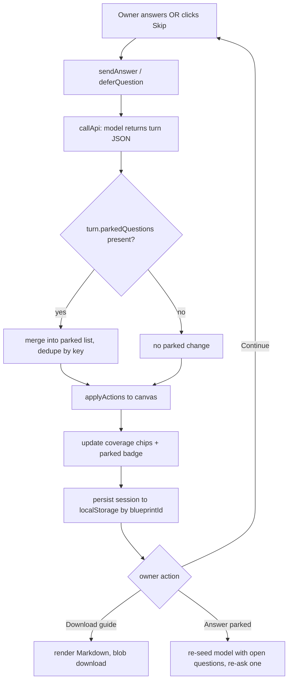

# feat: Parkable interview questions + downloadable interview guide

## Summary

Let a process owner say **"I don't know"** / **"I'll get that later"** during a Discovery or Grill interview without stalling. When they defer, the interviewer records the open question (with the coverage area it belongs to and *why it matters*), marks that area **partial** instead of pressing, and moves on — so the rest of the blueprint keeps filling out. Deferred questions accumulate into a downloadable **Interview Guide** (a Markdown questionnaire the owner can fill in solo or hand to colleagues). The interview session (including its parked questions) persists per-blueprint so the owner can come back later and run a focused **"Answer parked questions"** pass to fill in the blanks.

This is additive to the existing `src/features/interviewer/` feature. It changes the turn contract (one new optional array), the interviewer prompt, panel UI, and adds a guide-export util plus session persistence.

---

## Problem Frame

The Interviewer (`src/features/interviewer/`) builds a blueprint one question at a time and tracks seven coverage areas (trigger, steps, systems, decisions, exceptions, volumes, oversight). Today the owner is implicitly expected to answer every question. In practice, some answers aren't known in the moment — they live with another team, in a system the owner can't see, or need a decision that hasn't been made. The owner has three bad options: guess (pollutes the blueprint with low-quality data), stall the interview, or abandon it.

There is no way to say "skip this, I'll find out," no record of what was skipped, and no artifact to take away and go get the answers. The interview state is also fully ephemeral (`useState` in `useInterviewer`, wiped on panel close/reset), so "come back later" isn't possible at all.

**Goal:** deferring a question is a first-class, encouraged option; deferred questions become a takeaway document; and the owner can resume and close the gaps.

---

## Requirements

- **R1** — When the owner signals they can't answer ("I don't know", "not sure", "I'll get that later", "skip", or by an explicit UI action), the interviewer records the current question as a **parked question** rather than re-pressing, and continues to the next uncovered area.
- **R2** — Each parked question carries: the question text, the coverage area it belongs to, a short "why this matters" note, and any partial context the owner already gave.
- **R3** — A coverage area with only parked (unanswered) questions is reflected as **partial**, never **covered**, so the coverage chips honestly show the gap.
- **R4** — The owner is told, in the panel, that "I don't know / I'll get this later" is a valid option (passive hint + an explicit skip affordance on the current question).
- **R5** — The owner can **download an Interview Guide**: a Markdown questionnaire listing every parked question grouped by coverage area, each with its "why it matters" note and a blank answer space.
- **R6** — The interview session (mode, process context, transcript, coverage, parked questions) **persists per-blueprint** so closing the panel or reloading does not lose it.
- **R7** — When parked questions exist, the owner can start an **"Answer parked questions"** pass that re-asks the open questions one at a time so they can now be filled in; answering one clears it from the parked list and updates the canvas/coverage as a normal turn does.
- **R8** — Restarting from scratch (existing "Start over" / reset) still works and clears the persisted session for that blueprint.

---

## Key Technical Decisions

**KTD1 — Model-driven parking via a new `parkedQuestions` turn field (not client-side phrase detection).**
The interviewer already returns structured JSON each turn (`{message, actions, coverage, done, recommendedPattern}`). The cleanest, most robust way to capture a deferral is to extend that contract with an optional `parkedQuestions` array and instruct the model (in the system prompt) to populate it when the owner defers. The model has the full context to phrase the question well, attach the right coverage area, and write the "why it matters" note. Client-side phrase-matching ("I don't know") is brittle across phrasings and languages and can't produce the context note — so it is used only as a UI convenience (KTD2), never as the source of truth.

**KTD2 — An explicit "Skip — I'll get this later" affordance that sends a deterministic signal.**
Alongside the passive hint (R4), a skip button next to Send submits a canonical deferral answer (e.g., the current answer box text plus a machine-readable `[[DEFER]]` marker, or an empty defer) so the model reliably parks the *current* question even when the owner types nothing. This makes deferral discoverable and removes reliance on the owner phrasing it in a way the model recognizes.

**KTD3 — Parked-question identity + dedupe on the client.**
The model may re-emit a still-open parked question across turns. The hook maintains the parked list as the source of truth, deduping by a stable key (coverage area + normalized question text). Answering a parked question (R7) removes it by that key. This keeps the list stable without asking the model to track prior turns precisely.

**KTD4 — Interview Guide is Markdown, downloaded via the existing blob pattern.**
Markdown is human-fillable, pasteable into email/docs, diff-friendly, and needs no new dependency. Generation mirrors the download mechanics already used in `src/utils/export.ts` (`Blob` + `URL.createObjectURL` + anchor click). Grouped by coverage area, using `COVERAGE_LABELS`. (PDF/Word guide export is deferred — see Scope Boundaries.)

**KTD5 — Session persistence in localStorage, keyed by blueprint id, mirroring the app's existing storage convention.**
Every other piece of app state persists to localStorage (`blueprint-builder:*` keys). The interview session persists the same way under a per-blueprint key so it survives reload and panel close, and is cleared on reset (R8). This deliberately does **not** go through the hosted API/Postgres sync in this iteration (see Scope Boundaries).

---

## High-Level Technical Design

Turn lifecycle with parking (Discovery/Grill unchanged except the parked path):



Data added to the turn contract:

```
ParkedQuestion = {
  id: string            // stable client key: `${area}:${normalizedText}`
  question: string
  area: CoverageArea
  why: string           // "why this matters" note from the model
  context?: string      // partial info the owner already gave
}

InterviewerTurn += { parkedQuestions?: ParkedQuestion[] }   // optional, defaults []
InterviewSession = { mode, processContext, messages, coverage, parkedQuestions, updatedAt }
```

---

## Implementation Units

### U1. Parked-question types and turn-contract extension

**Goal:** Add the `ParkedQuestion` type and thread an optional `parkedQuestions` array through the turn contract and its parser.

**Requirements:** R1, R2

**Dependencies:** none

**Files:**
- `src/features/interviewer/types.ts` (add `ParkedQuestion`, extend `InterviewerTurn`, add `InterviewSession`)
- `src/features/interviewer/useInterviewer.ts` (`extractTurn` parses/normalizes `parkedQuestions`)
- `src/features/interviewer/parsePattern.test.ts` (existing test file for this module) or a new `parkedQuestions.test.ts`

**Approach:**
- `ParkedQuestion` as in the HTD. Add a `parkedQuestionKey(area, question)` helper that lowercases/trims/collapses whitespace of the text and joins with the area to form `id` (used for dedupe in U3).
- Extend `InterviewerTurn` with `parkedQuestions?: ParkedQuestion[]`.
- In `extractTurn`, read `parsed.parkedQuestions`; validate each entry has a non-empty `question` and an `area` in the `CoverageArea` set (drop invalid ones, mirroring how `parsePattern` drops out-of-catalog ids); backfill `id` via `parkedQuestionKey`; default `why`/`context` to `''`. Default the field to `[]` when absent so existing turns are unaffected.
- Add `InterviewSession` type here for U5.

**Patterns to follow:** `parsePattern` validation/drop-invalid style in `useInterviewer.ts`; `emptyCoverage()` factory in `types.ts`.

**Test scenarios:**
- `extractTurn` on a turn JSON with a valid `parkedQuestions` entry returns it with a derived `id` and defaulted `why`/`context`.
- `extractTurn` drops a parked entry whose `area` is not a valid `CoverageArea`.
- `extractTurn` drops a parked entry with empty/missing `question`.
- `extractTurn` on a turn with no `parkedQuestions` returns `parkedQuestions: []` (backward compat).
- `parkedQuestionKey` normalizes case/whitespace so two phrasings differing only by spacing/case produce the same key.

---

### U2. Interviewer prompt: recognize deferral and emit parked questions

**Goal:** Teach the model to treat "I don't know / I'll get this later" as a valid, encouraged answer — record the question in `parkedQuestions`, mark the area partial, and move on.

**Requirements:** R1, R2, R3

**Dependencies:** U1

**Files:**
- `src/utils/aiPromptStorage.ts` (the `interviewer` default `systemPrompt` and `userPromptTemplate`)

**Approach:**
- Add a hard rule to the interview-discipline block: if the owner signals they can't answer (examples: "I don't know", "not sure", "I'll get that later", "skip", or an explicit defer marker), do **not** re-press. Record the current question in `parkedQuestions` with its `area`, a one-line `why` (why the answer matters to the blueprint), and any `context` already given; set that area's coverage to `partial` (or leave `missing` if nothing was captured), and ask the next question about a different uncovered area.
- Extend the documented Response format to include the optional `parkedQuestions` array with field descriptions.
- Note in the prompt that a still-open parked question may be re-listed on later turns (client dedupes) and should be dropped from `parkedQuestions` once the owner answers it.
- Clarify `done`: the interview can be "done for now" with parked questions outstanding — when the owner says they're done, summarize and list how many questions remain parked.

**Patterns to follow:** existing numbered "Interview discipline (hard rules)" and "Response format" sections in the `interviewer` prompt; keep JSON-only output contract intact. Because prompts are user-overridable via AI Prompt Admin, only the **default** prompt is edited here.

**Test scenarios:** `Test expectation: none — prompt-only change (default string).` Behavior is exercised through U3/U5 hook tests using mocked turn JSON; prompt wording itself is not unit-tested. Manually verify one deferral round-trip in the running app (see U6 Verification).

---

### U3. Hook state: accumulate, dedupe, and clear parked questions; deferral action

**Goal:** Make `useInterviewer` own the parked-question list as source of truth, expose it, and add an explicit `deferQuestion()` action.

**Requirements:** R1, R3, R7 (clearing on answer)

**Dependencies:** U1

**Files:**
- `src/features/interviewer/useInterviewer.ts`
- `src/features/interviewer/parkedQuestions.test.ts` (new; hook-level or reducer-level tests)

**Approach:**
- Add `parkedQuestions` state (`ParkedQuestion[]`). In `runTurn`, merge `turn.parkedQuestions` into state deduping by `id` (KTD3): new keys appended, existing keys refreshed (latest `why`/`context` win).
- Remove-on-answer: when the model's turn no longer lists a previously-parked key **and** a corresponding area advances to `covered`, or when an explicit answer targets a parked id (U5 flow), remove it. Keep the rule simple and deterministic — prefer explicit removal driven by the "answer parked" flow (U5) plus dedupe-refresh here; document that ambient removal is best-effort.
- Add `deferQuestion(currentText?: string)`: sends a canonical deferral through `sendAnswer` (KTD2) — appends a `[[DEFER]]` marker (and any typed partial text) so the model reliably parks the current question.
- Extend `reset()` to clear `parkedQuestions`. Return `parkedQuestions` and `deferQuestion` from the hook.

**Patterns to follow:** existing `useState` + `useCallback` structure and the `applyActions`/`runTurn` flow in `useInterviewer.ts`.

**Test scenarios:**
- Merging a turn with two parked questions populates state with both, keyed by `id`.
- A second turn re-emitting one existing parked key does not duplicate it (length stays stable) and refreshes its `why`.
- `deferQuestion('half an answer')` produces an outgoing answer containing both the partial text and the defer marker.
- `reset()` empties `parkedQuestions`.
- A parked question whose area later becomes `covered` and is no longer re-emitted is removed.

---

### U4. Interview Guide generation and download

**Goal:** Render parked questions into a Markdown questionnaire and download it.

**Requirements:** R5

**Dependencies:** U1

**Files:**
- `src/features/interviewer/interviewGuide.ts` (new: `buildInterviewGuideMarkdown(session)` + `downloadInterviewGuide(session, blueprintTitle)`)
- `src/features/interviewer/interviewGuide.test.ts` (new)

**Approach:**
- `buildInterviewGuideMarkdown` produces: a title (blueprint name + "Interview Guide"), a short intro line ("Answer what you can, then reload the interview to fill these in"), then one `##` section per coverage area **that has parked questions**, ordered by the `COVERAGE_LABELS` key order. Each question renders as its text, an italic "_Why it matters:_" line, an optional "_You mentioned:_" context line, and a blank answer area (e.g., `**Answer:** _______`).
- `downloadInterviewGuide` serializes to a `Blob` (`text/markdown`) and triggers an anchor download named `<safe-title>-interview-guide.md`, mirroring `download*` mechanics in `src/utils/export.ts`.
- Empty case: if no parked questions, `buildInterviewGuideMarkdown` returns a friendly "No open questions — nothing to collect" body (the button that calls it is hidden when count is 0, but the util stays safe).

**Patterns to follow:** blob/anchor download and filename-sanitization in `src/utils/export.ts` (lines ~30–41); `COVERAGE_LABELS` from `types.ts`.

**Test scenarios:**
- Two parked questions in different areas render under two `##` sections in `COVERAGE_LABELS` order.
- A question with a `context` note renders the "You mentioned" line; one without omits it.
- Each rendered question includes its `why` line and an answer blank.
- Empty parked list yields the "nothing to collect" body without throwing.
- Filename sanitization strips unsafe characters from the blueprint title.

---

### U5. Per-blueprint session persistence and "Answer parked questions" resume

**Goal:** Persist the interview session to localStorage keyed by blueprint id, restore it on open, and add a focused resume that re-asks open parked questions.

**Requirements:** R6, R7, R8

**Dependencies:** U1, U3

**Files:**
- `src/features/interviewer/interviewSessionStorage.ts` (new: `loadSession(blueprintId)`, `saveSession(blueprintId, session)`, `clearSession(blueprintId)`)
- `src/features/interviewer/useInterviewer.ts` (persist after each turn; hydrate on start/open; `resumeParked()` action)
- `src/features/interviewer/interviewSessionStorage.test.ts` (new)

**Approach:**
- Storage key `blueprint-builder:interview-session:<blueprintId>`. `saveSession` writes `{mode, processContext, messages, coverage, parkedQuestions, updatedAt}`; `loadSession` parses defensively (return null on malformed JSON, matching `loadCustomPrompts` in `aiPromptStorage.ts`).
- The hook reads the active blueprint id from `useBlueprintStore` (already imported). After each `runTurn`, persist the current session. On mount/open with an existing session, hydrate state so the transcript, coverage, and parked list reappear (panel offers "Resume" vs "Start over").
- `resumeParked()`: constructs a kickoff that lists the open parked questions and instructs the model to re-ask them one at a time so the owner can now answer; reuses `runTurn`. Answered ones clear via U3's removal path.
- `reset()` also calls `clearSession(blueprintId)` (R8).

**Patterns to follow:** localStorage load/save/parse-guard in `src/utils/aiPromptStorage.ts` (`loadCustomPrompts`, `STORAGE_PREFIX`); `useBlueprintStore` access already present in `useInterviewer.ts`.

**Test scenarios:**
- `saveSession` then `loadSession` for the same id round-trips mode, coverage, and parked questions.
- `loadSession` on a missing key returns null; on malformed JSON returns null without throwing.
- `clearSession` removes the key so a subsequent `loadSession` returns null.
- Two different blueprint ids keep independent sessions.
- `resumeParked()` with two open questions issues a turn whose outgoing prompt references both.

---

### U6. Panel UI: deferral hint, skip button, parked badge/list, guide download, resume

**Goal:** Surface all of the above in `InterviewerPanel` — tell the owner deferral is allowed, let them skip, show what's parked, download the guide, and resume.

**Requirements:** R4, R5, R7, R8

**Dependencies:** U3, U4, U5

**Files:**
- `src/features/interviewer/InterviewerPanel.tsx`

**Approach:**
- Consume `parkedQuestions`, `deferQuestion`, `resumeParked` from the hook.
- **Hint (R4):** a one-line helper under the input, e.g. "Don't have an answer? Say *I don't know* or tap **Skip** — we'll save it for later."
- **Skip button (KTD2):** a secondary button next to Send that calls `deferQuestion(answer)` and clears the box; disabled while thinking or before the interview starts.
- **Parked surface:** a chip/counter near the coverage chips ("3 parked") that expands a collapsible list of parked questions grouped by area (reusing `COVERAGE_LABELS`).
- **Download guide (R5):** a "Download interview guide" button shown when `parkedQuestions.length > 0`, wired to `downloadInterviewGuide(session, blueprintTitle)`.
- **Resume (R7):** when parked questions exist, an "Answer parked questions" button calls `resumeParked()`. On panel open with a persisted session, show a "Resume interview" vs "Start over" choice (Start over routes to existing `reset`).
- Keep styling consistent with the existing Tailwind classes and lucide icons already used in the panel (e.g., `SkipForward`/`Download`/`ListChecks`).

**Patterns to follow:** existing button/chip markup and coverage-chip rendering in `InterviewerPanel.tsx`; icon imports from `lucide-react`.

**Test scenarios:** `Test expectation: none — presentational wiring.` If a component test harness exists for the panel, add: skip button calls `deferQuestion`; guide button hidden when no parked questions; parked counter reflects list length. Otherwise cover via U6 manual verification.

**Verification:** In the running app (`npm run dev`): start a Discovery interview, answer one question, then answer the next with "I don't know" and separately test the **Skip** button — confirm the question is parked (counter increments, area shows partial), the interview continues, the guide downloads with the parked questions grouped by area, closing/reopening the panel restores the session, and "Answer parked questions" re-asks them.

---

## Scope Boundaries

**In scope:** Deferral recognition (model + explicit skip), parked-question capture with context, honest partial coverage, Markdown interview-guide download, per-blueprint localStorage session persistence, and a focused resume to answer parked questions.

### Deferred to Follow-Up Work
- **Guide export in PDF/Word** to match the blueprint export formats — Markdown only for now (KTD4).
- **Syncing interview sessions through the hosted API/Postgres** so parked questions follow the blueprint across devices — this iteration is localStorage-only (KTD5).
- **Re-importing a filled-in guide** (parsing answers back out of the Markdown to auto-seed the resume) — for now the owner reads their answers and types them during the resume pass.
- **Assigning parked questions to specific colleagues** / multi-owner routing inside the guide.

**Out of scope (non-goals):** Changing the seven coverage areas, the pattern-recommendation flow, or the canvas action schema; adding new node types.

---

## Risks & Dependencies

- **Model compliance risk:** the model may keep pressing instead of parking, or format `parkedQuestions` loosely. Mitigated by the explicit hard rule + JSON schema in the prompt (U2), the deterministic Skip signal (KTD2), and defensive parsing that drops malformed entries (U1).
- **Dedupe drift:** normalized-text keys could merge two genuinely different questions in the same area, or fail to merge near-duplicates. Low impact (a slightly redundant or slightly merged guide line); accept for this iteration.
- **Prompt override interaction:** users who have customized the interviewer prompt via AI Prompt Admin won't get the new parking rule until they reset to defaults. Note this in the panel copy is out of scope; behavior degrades gracefully (no parking, existing flow intact).
- **Dependency:** all work is inside `src/features/interviewer/` plus the `interviewer` default prompt in `src/utils/aiPromptStorage.ts`; no new npm packages.

---

## Requirements Traceability

| Req | Units |
|-----|-------|
| R1 defer → park, don't press | U2, U3 |
| R2 question + area + why + context | U1, U2 |
| R3 partial coverage on parked-only area | U2, U3 |
| R4 tell owner deferral is an option | U6 |
| R5 download interview guide | U4, U6 |
| R6 per-blueprint session persistence | U5 |
| R7 resume to answer parked questions | U3, U5, U6 |
| R8 reset clears session | U3, U5, U6 |
