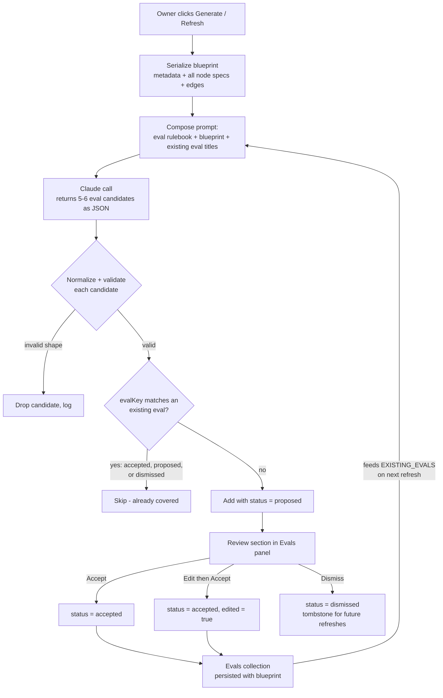
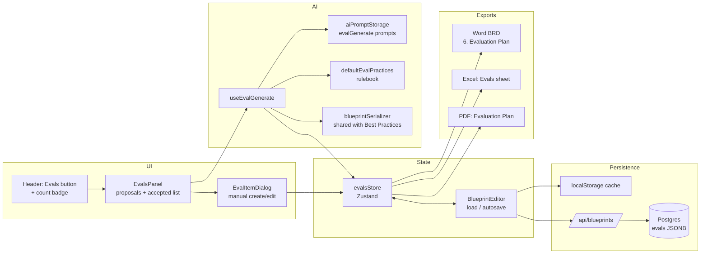

# feat: Workflow evals — AI-generated evaluation plan for a blueprint

## Summary

Give every blueprint a first-class **Evals** collection: the set of checks that would tell you whether this agentic workflow is actually working once it is built and running. When the owner feels the blueprint is "done enough," they open an **Evals** panel and click **Generate evals**. The builder serializes the whole workflow — blueprint metadata, orchestration pattern, and every node's goal / skills / tools / guardrails / success criteria / stop conditions / HITL policy — sends it to Claude alongside a built-in eval-design rulebook distilled from published agent-eval guidance, and gets back **5–6 proposed evals** spanning outcome, trajectory, quality, safety, oversight, and efficiency dimensions. Some are workflow-wide; some are pinned to a specific node.

Proposals land in a review step. The owner accepts, edits, or dismisses each one. Accepted evals become editable items the owner can also create by hand. As the blueprint evolves, **Refresh** re-runs generation and merges *additively* — it never edits or deletes an existing eval, skips anything already covered, and never re-proposes something the owner previously dismissed. Evals persist with the blueprint (localStorage cache → Postgres via the `/api` layer) and surface in the Word BRD, Excel, and PDF exports as an **Evaluation Plan** the engineering team can build against.

This is additive. It introduces one new blueprint-level collection, one new AI feature, one new panel, and one new DB column — all following patterns the codebase already uses (Parking Lot for the collection + panel; Best Practices Analysis for the whole-blueprint AI call; interviewer parked-questions for normalized-key dedupe; `orchestration_pattern` for the persistence path).

---

## Problem Frame

The builder is good at describing *what the workflow does* — nodes, goals, tools, guardrails, HITL gates, orchestration pattern — and exports a technical handoff for an engineering team. It says nothing about **how anyone would know the built workflow is working**.

That gap is expensive at exactly the moment this tool is used. The blueprint is the artifact handed to engineers; if it carries no evaluation plan, evals get invented late (or never), by people who no longer have the process owner in the room. Published guidance is consistent that the highest-leverage moment to write evals is *early* — writing them forces the team to state what success actually means, before the implementation makes that decision implicitly ([Anthropic](https://www.anthropic.com/engineering/demystifying-evals-for-ai-agents)).

The builder is also uniquely positioned to draft them. It already holds the two things eval design needs: a structured description of every agent, tool, loop, route, and human gate; and a built-in rulebook of the failure modes those constructs produce (`src/data/defaultBestPractices.ts`). A generic "write me some evals" prompt cannot produce "does the router send refund requests over $500 to the human approval gate instead of the auto-refund agent" — but a prompt grounded in *this* canvas can.

**Goal:** make "what evals would tell us this is working?" a normal, low-friction step of blueprint authoring, with an AI first draft the owner refines rather than a blank page.

**Non-goal:** running evals. This feature produces an evaluation *plan* — a specification an engineering team implements in their own harness. The builder never executes a test case or scores a trace.

---

## Requirements

- **R1** — A blueprint carries a collection of **evals**, persisted with it (localStorage cache + hosted API/Postgres), round-tripping through JSON export/import.
- **R2** — Each eval is either **workflow-level** (about the blueprint overall) or **node-level** (pinned to one node), using the same `linkedNodeId: string | null` convention as the Parking Lot.
- **R3** — The owner can trigger **AI generation** of evals from a single action once they judge the workflow complete enough. A first run proposes **5–6** evals.
- **R4** — Generation is grounded in the *whole* workflow: blueprint metadata (title, description, orchestration pattern, business benefits, impacted audiences, status) **and** every node's metadata (type, goal, inputs/tasks/outputs, integrations, agent-spec description, skills, tools, autonomy level, guardrails, success criteria, stop/termination conditions, iteration bounds, routes, branches, join behavior, HITL policy).
- **R5** — Generation is grounded in **eval best practices**: a built-in rulebook shipped with the app, applied ahead of any prompt customization, encoding the practices in [Sources & Research](#sources--research) (binary pass/fail, one criterion per eval, deterministic graders before LLM judges, evals anchored to a concrete failure mode, outcome *and* trajectory coverage, required test data named).
- **R6** — Generated evals **generalize across the workflow**, not just per-node: a run must produce at least two workflow-level evals and must span more than one eval dimension.
- **R7** — The owner can **refresh** generation as the blueprint evolves. Refresh is **strictly additive**: it never mutates or deletes an existing eval, it skips proposals already covered by an existing eval, and it does not re-propose evals the owner has dismissed.
- **R8** — The owner can **manually add, edit, and delete** evals at any time, independent of generation.
- **R9** — Proposed evals are visibly distinguishable from accepted ones, and the owner accepts or dismisses them individually (plus an "accept all" convenience).
- **R10** — Evals surface in the **Word BRD** as an Evaluation Plan section, and in the **Excel** and **PDF** exports as tables, so the handoff carries them.
- **R11** — When a blueprint is far enough along to be reviewed or approved but has no evals, the validation panel raises an **advisory warning** (never an error — evals never block export).
- **R12** — The eval-generation prompts are editable through the existing **AI Prompt Admin** dialog, like every other AI feature.

---

## Key Technical Decisions

**KTD1 — Evals are a blueprint-level collection modeled on the Parking Lot, surfaced in a slide-over panel.**
The Parking Lot (`src/types/parkingLot.ts`, `src/store/parkingLotStore.ts`, `src/components/panels/ParkingLotPanel.tsx`, `src/components/dialogs/ParkingLotItemDialog.tsx`) is already exactly the right shape: an array on `Blueprint`, items optionally linked to a node or to "Blueprint Overall", a filterable/sortable slide-over panel, an item dialog for create/edit, a header button with an unresolved-count badge, and export coverage in Excel/PDF/Word. Evals reuse that whole shape rather than inventing a new surface.

Rejected alternatives: putting evals inside the expanded **Blueprint Metadata** header (it is a flat field editor, not a list-with-review-state surface, and would bury a feature that needs room to breathe); a footer tab beside the Validation panel (validation is derived and ephemeral — evals are authored, persisted content, and the footer is short).

**KTD2 — Generation is a proposal step, never a direct write.**
A generation run never mutates existing evals. It returns candidates that enter the collection with `status: 'proposed'` and are rendered in a distinct review section of the panel. Accept promotes to `status: 'accepted'`; dismiss sets `status: 'dismissed'` (kept, hidden by default, and used as the refresh tombstone). This is what makes R7 safe by construction — there is no code path where generation edits or deletes user content, so "refresh blew away my edits" cannot happen.

**KTD3 — Refresh dedupes with a normalized key, mirroring `parkedQuestions.ts`.**
The interviewer already solves "the model re-emits something we already have" by deduping on a normalized `area:question` key. Evals use the same technique: `evalKey(item) = ${dimension}:${linkedNodeId ?? 'workflow'}:${normalize(title)}`, where `normalize` lowercases, strips punctuation, and collapses whitespace. A proposal whose key matches **any** existing eval — accepted, proposed, *or* dismissed — is dropped before it reaches the panel. Dismissed items are therefore tombstones, which is why they are retained rather than deleted.

Key collision is a soft failure by design: a near-duplicate that slips through is a redundant proposal the owner dismisses in one click. The prompt also receives the existing eval titles (`{{EXISTING_EVALS}}`) so the model avoids repeats before dedupe ever runs.

**KTD4 — The eval is a specification, not an implementation.**
Each eval carries the fields an engineer needs to build the check, drawn from the researched practice: a **binary question** (pass/fail, one criterion — never a 1–5 rating), a **pass criterion**, the **grader type** (deterministic / llm-judge / human-review / hybrid), the **data needed** (what traces, golden cases, or fixtures the check requires), and the **failure mode** it protects against. The failure-mode field is load-bearing: published guidance is emphatic that evals written without a specific failure in mind become generic "helpfulness" metrics that measure nothing ([Hamel Husain & Shreya Shankar](https://hamel.dev/blog/posts/evals-faq/)). Requiring the model to name the failure forces the eval to be about *this* workflow.

**KTD5 — A built-in eval rulebook, mirroring `defaultBestPractices.ts`.**
`src/data/defaultEvalPractices.ts` ships a rulebook that is always prepended to the generation prompt: prefer deterministic graders, one binary criterion per eval, anchor to a named failure mode, cover both outcome and trajectory, name the test data, keep the starter set small (5–6) and biased toward the workflow's riskiest constructs (unbounded loops, autonomous nodes taking irreversible actions, model-driven routing, HITL escalation paths). This keeps eval quality independent of whether the user has customized prompts, exactly as the agent-design rulebook does for the Best Practices check.

**KTD6 — Extract `serializeBlueprintForAnalysis` into a shared module.**
`useBestPracticesAnalysis.ts` already contains a thorough whole-blueprint serializer covering every node type's agent-spec, HITL policy, loops, routes, and connections — precisely the grounding R4 requires. It moves verbatim to `src/utils/blueprintSerializer.ts`; the existing hook imports it. A second copy would drift the moment a node type gains a field, and drift here silently degrades both features.

The serializer today covers nodes and edges only. Eval generation also needs blueprint metadata, so the module gains a small sibling, `serializeBlueprintMetadata`, rather than changing the existing function's signature or output (which the Best Practices prompt is calibrated against).

**KTD7 — Persistence follows the `orchestration_pattern` path exactly.**
Migration `003_evals.sql` adds a nullable `evals JSONB DEFAULT '[]'` column (idempotent `ADD COLUMN IF NOT EXISTS`, matching 002). `server/blueprints.ts` gains the field in `BlueprintDoc`, `blueprintToRow`, `rowToBlueprint`, and `COLUMNS`. The client-side `Blueprint` type gains `evals: EvalItem[]`, defaulted at every construction and normalized on import (`evals: blueprint.evals || []`), so blueprints saved before this change load unchanged. The whole-blueprint save path in `BlueprintEditor.saveToLibrary` carries it, so the localStorage cache and API sync need no other changes.

Deployment note: the migration must be applied before a client writes evals, or the insert fails on an unknown column. This is the same ordering constraint 002 had — `npm run db:migrate` (see `docs/deployment.md`).

**KTD8 — The generation hook mirrors `useBestPracticesAnalysis`, not Smart Import.**
Same shape: read API key from `getApiKey()`, read prompts from `getActivePrompts('evalGenerate')`, `AbortController` with a timeout, `fetch` to `ANTHROPIC_API_URL` with the browser-access header, parse a JSON array out of the response, normalize and validate each item, surface errors as strings. Smart Import's progress/cancel machinery is overkill for a single sub-minute call. Timeout is 90s (not the 60s used by the smaller features) — this call serializes the entire canvas and asks for six structured objects, so it is closer to Smart Import's envelope than to Goal Evaluate's.

**KTD9 — W012 is status-gated so it never nags a fresh canvas.**
"No evals defined" is only meaningful once the owner considers the workflow real. The warning fires only when `status` is `In Review` or `Approved` **and** the blueprint has at least 3 nodes **and** no non-dismissed evals exist. `validateBlueprint` gains a fifth optional options-object parameter rather than a sixth and seventh positional argument.

---

## High-Level Technical Design

*Directional guidance for review — not implementation specification.*

### Generate → merge → review loop

The critical property: no arrow runs from generation into an existing accepted eval. Refresh can only *add* or *skip*.

### Where the pieces sit

---

## Assumptions

Scoping bets made without a synchronous check-in (pipeline run). Each is cheap to revisit.

- **A1** — Evals belong on the blueprint, not on individual nodes' detail panels. Node-level evals exist but are authored and reviewed from the same central panel, filtered by node — the same choice the Parking Lot made. A per-node "Evals" section in `DetailPanel` is deferred.
- **A2** — "5 to 6 evals" is a prompt-level instruction with a hard client-side cap (8) rather than a strict contract. A model returning 5 or 7 good evals is a success; the cap exists to stop a runaway response from flooding the panel.
- **A3** — Evals are not versioned or timestamped against a blueprint revision. The existing `blueprint_revisions` table already snapshots the whole document on every server save, so eval history comes along for free without new machinery.
- **A4** — No eval-count badge on canvas nodes in this iteration (the Parking Lot badge already occupies that corner of `BaseNode`). Deferred.
- **A5** — Generation is available at any time, not gated behind validation passing. The empty state explains it works best on a reasonably complete workflow, and the panel shows the current error count as a nudge — but it never blocks.

---

## Implementation Units

### U1. Eval data model, store, and client persistence

**Goal:** Evals exist as a typed, persisted blueprint-level collection with full CRUD, before any AI or UI is involved.

**Requirements:** R1, R2, R8

**Dependencies:** none

**Files:**
- `src/types/evals.ts` (new)
- `src/types/index.ts` (re-export)
- `src/types/blueprint.ts` (add `evals: EvalItem[]` to `Blueprint`)
- `src/store/evalsStore.ts` (new)
- `src/store/evalsStore.test.ts` (new)
- `src/store/index.ts` (export store + selectors)
- `src/data/defaultBlueprint.ts` (seed `evals: []`)
- `src/features/patterns/createBlueprint.ts` (seed `evals: []`)
- `src/utils/import.ts` (normalize `evals: blueprint.evals || []` in `normalizeEdges`)
- `src/utils/import.test.ts` (extend fixture + assertions)
- `src/components/pages/BlueprintEditor.tsx` (hydrate on load, include in `saveToLibrary`, add to autosave dep array)

**Approach:**
`EvalItem` fields: `id`, `title`, `dimension` (`outcome` | `trajectory` | `quality` | `safety` | `oversight` | `efficiency`), `graderType` (`deterministic` | `llm-judge` | `human-review` | `hybrid`), `question` (the binary pass/fail question), `passCriteria`, `dataNeeded`, `failureMode`, `linkedNodeId: string | null`, `priority` (`high` | `medium` | `low`), `status` (`proposed` | `accepted` | `dismissed`), `origin` (`ai` | `manual`), `aiConfidence?`, `aiNotes?`, `edited: boolean`, `createdAt`, `updatedAt`.

`evalsStore` mirrors `parkingLotStore`: `items`, `addItem` (stamps id/timestamps, returns id), `updateItem` (stamps `updatedAt`; sets `edited: true` when the item's `origin` is `ai` and a content field changed), `deleteItem`, `setItems`, `reset`, plus `addProposals(items)` for bulk insert from generation. Selectors: `selectAcceptedEvalCount`, `selectProposedEvalCount`, `selectEvalCountForNode(nodeId)`.

The `edited` flag is informational (it drives an "edited" chip in the panel and documents that a proposal was refined) — refresh safety comes from KTD2, not from this flag.

**Patterns to follow:** `src/store/parkingLotStore.ts` for store shape and the auto-stamp-on-status-change idiom; `src/types/parkingLot.ts` for the type + color-map layout; `BlueprintEditor.tsx:100` (`setParkingLotItems(blueprint.parkingLot || [])`) and `:148` (`parkingLot: currentParkingLot`) for the hydrate/save seam.

**Test scenarios** (`src/store/evalsStore.test.ts`, `src/utils/import.test.ts`):
- `addItem` returns a UUID, stamps `createdAt`/`updatedAt`, defaults `status: 'accepted'` for manual origin and `edited: false`.
- `addProposals` inserts multiple items preserving order and leaves existing items untouched.
- `updateItem` on an AI-origin item with a changed `question` sets `edited: true` and advances `updatedAt`; a status-only change (accept/dismiss) does **not** set `edited`.
- `updateItem` on a manual-origin item leaves `edited` false.
- `updateItem` with an unknown id is a no-op (no throw, no array mutation).
- `deleteItem` removes only the target; `setItems`/`reset` replace/clear wholesale.
- `selectEvalCountForNode` counts only non-dismissed items with that `linkedNodeId`; workflow-level items (`null`) are excluded.
- Import of a blueprint JSON with no `evals` key yields `evals: []` (backward compatibility).
- Import of a blueprint JSON with populated `evals` round-trips every field.
- Editor hydrate/save: loading a blueprint with evals populates the store; saving reads the store back into the blueprint document.

---

### U2. Server + database persistence

**Goal:** Evals survive the round trip through the hosted API and Postgres.

**Requirements:** R1

**Dependencies:** U1

**Files:**
- `db/migrations/003_evals.sql` (new)
- `server/blueprints.ts` (`BlueprintDoc.evals`, `blueprintToRow`, `rowToBlueprint`, `COLUMNS`)
- `server/blueprints.test.ts` (extend)
- `docs/deployment.md` (note the new migration)

**Approach:**
Migration is a single idempotent `ALTER TABLE blueprints ADD COLUMN IF NOT EXISTS evals JSONB DEFAULT '[]';` with a comment explaining the default, matching `002_orchestration_pattern.sql`'s style. Server-side the field is `unknown[]` — the server validates blueprint *structure* (ids, node types, edges) and stores the rest opaquely, per the existing "client remains the type authority" comment at the top of `server/blueprints.ts`. Do not add per-eval validation to the server; it would duplicate client types across the boundary the file explicitly avoids.

`COLUMNS` must include `evals` or reads silently return `undefined` and every load wipes the field — the same trap `orchestration_pattern` had to thread.

**Patterns to follow:** `db/migrations/002_orchestration_pattern.sql`; the `parking_lot` field's treatment throughout `server/blueprints.ts` (it is the closest analog — a JSONB array of opaque objects).

**Test scenarios** (`server/blueprints.test.ts`):
- `blueprintToRow` serializes a populated `evals` array to JSON and an absent one to `'[]'`.
- `rowToBlueprint` restores a populated `evals` array, and yields `[]` for a NULL/absent column (pre-migration rows).
- Round trip `blueprintToRow` → `rowToBlueprint` preserves every eval field including `linkedNodeId: null`.
- `COLUMNS` contains `evals` (guards the silent-drop regression).
- `validateBlueprint` accepts a blueprint with evals and one without — evals never make a document invalid.

---

### U3. Shared blueprint serializer + eval-design rulebook

**Goal:** One canonical whole-workflow serialization, plus the built-in eval practices that ground generation.

**Requirements:** R4, R5

**Dependencies:** none (can land in parallel with U1/U2)

**Files:**
- `src/utils/blueprintSerializer.ts` (new — `serializeBlueprintForAnalysis` moved verbatim, plus new `serializeBlueprintMetadata`)
- `src/utils/blueprintSerializer.test.ts` (new)
- `src/utils/index.ts` (export)
- `src/hooks/useBestPracticesAnalysis.ts` (delete the local copies, import from the new module)
- `src/data/defaultEvalPractices.ts` (new)

**Approach:**
Move `serializeAgentSpec` and `serializeBlueprintForAnalysis` out of `useBestPracticesAnalysis.ts` unchanged — same output, byte for byte, so the Best Practices prompt stays calibrated. Add `serializeBlueprintMetadata(metadata)` producing a compact block: title, description, orchestration pattern name (resolved via `getPattern`, falling back to "Freeform"), status, version, impacted audiences, business benefits.

`BUILT_IN_EVAL_PRACTICES` is a template literal in the style of `BUILT_IN_BEST_PRACTICES`, with sections covering: what makes an eval (binary question, one criterion, named failure mode, named test data); grader selection (deterministic first, LLM-judge only where judgment is required, human review as the calibration gold standard); dimension coverage (outcome, trajectory, quality, safety, oversight, efficiency) with an instruction to span several; the starter-set size (5–6, at least two workflow-level); and where to look in an agentic blueprint for risk (unbounded loops, autonomous nodes with irreversible actions, model-driven routing vs. rule-based decisions, HITL escalation paths, parallel joins, orchestrator worker selection). Every rule traces to a source in [Sources & Research](#sources--research).

**Execution note:** This unit is a pure extraction plus new content. Add the serializer's characterization tests *before* moving the code, so the move is provably output-preserving.

**Test scenarios** (`src/utils/blueprintSerializer.test.ts`):
- A work-agent node with goal, inputs (required + optional), tasks, outputs, integrations, full agent spec, and an `approval` HITL policy serializes every field, with `*` marking required I/O.
- A node missing success criteria emits the literal `NOT DEFINED` marker (downstream prompts rely on it).
- A node with `hitl.mode === 'none'` emits `Human oversight: none (fully autonomous)`; a node with approval mode but no escalation path emits `NO ESCALATION PATH`.
- Each agentic node type (orchestrator, agentLoop, router, parallel split, parallel join, evaluatorOptimizer) emits its type-specific fields, including `NOT DEFINED` for absent termination/stop/pass conditions.
- Edges serialize as `source -> target` with `[label]` when labeled.
- Empty blueprint (zero nodes, zero edges) produces a well-formed header with no throw.
- `serializeBlueprintMetadata` renders a set pattern by name, an unset pattern as `Freeform`, and omits empty array fields rather than printing empty bullets.
- `BUILT_IN_EVAL_PRACTICES` is non-empty and mentions each of the six dimension names (guards against a rulebook edit silently dropping a dimension the prompt promises).

---

### U4. AI eval generation feature

**Goal:** One Claude call turns the whole workflow into 5–6 validated eval candidates.

**Requirements:** R3, R4, R5, R6, R12

**Dependencies:** U1, U3

**Files:**
- `src/constants/aiModels.ts` (add `evalGenerate` to `AI_FEATURE_MODELS`)
- `src/utils/aiPromptStorage.ts` (add `'evalGenerate'` to `AIFeatureKey`, a `getFeatureConfigs()` entry with placeholders, and a `DEFAULT_PROMPTS` entry)
- `src/hooks/useEvalGenerate.ts` (new)
- `src/hooks/useEvalGenerate.test.ts` (new)
- `src/hooks/index.ts` (export)
- `src/features/evals/parseEvalResponse.ts` (new — response normalization/validation)
- `src/features/evals/parseEvalResponse.test.ts` (new)

**Approach:**
Placeholders: `{{EVAL_PRACTICES}}`, `{{BLUEPRINT_METADATA}}`, `{{BLUEPRINT_TEXT}}`, `{{EXISTING_EVALS}}`. The system prompt casts Claude as an evaluation engineer designing the eval suite for an agentic workflow about to be built, and pins the output contract to a bare JSON array of objects with the `EvalItem` authoring fields (`title`, `dimension`, `graderType`, `question`, `passCriteria`, `dataNeeded`, `failureMode`, `linkedNodeId`, `priority`, `confidence`, `notes`). The user template instructs: 5–6 evals, at least two with `linkedNodeId: null`, span at least three dimensions, prefer `deterministic` where a check is mechanically verifiable, and never restate an eval listed in `{{EXISTING_EVALS}}`.

`parseEvalResponse` is a pure function taking raw response text plus the current node id set, and returning `{ items: EvalCandidate[]; dropped: number }`. It extracts the first `[...]` block (same `match(/\[[\s\S]*\]/)` idiom as `useBestPracticesAnalysis`), then per candidate: requires non-empty `title` and `question`; coerces `dimension`/`graderType`/`priority` to the known unions, falling back to `quality`/`llm-judge`/`medium` on anything unrecognized; maps a `linkedNodeId` that does not exist on the canvas to `null` (a hallucinated node id must degrade to a workflow-level eval, never dangle); trims strings; and caps the result at 8 (A2). Everything else is dropped and counted.

Keeping this pure and separate from the hook is what makes the parsing rules testable without mocking `fetch`.

The hook exposes `generateEvals(nodes, edges, metadata, existingEvals)`, `isGenerating`, `candidates`, `error`, `clearError`, `clearCandidates`, and an `abort`. 90s timeout via `AbortController` (KTD8). Missing API key produces the same actionable message the sibling hooks use, pointing at Smart Import settings.

**Patterns to follow:** `src/hooks/useBestPracticesAnalysis.ts` end to end (key retrieval, prompt assembly, fetch headers, timeout, JSON extraction, error strings); `src/features/smartImport/utils/responseParser.ts` for a pure parser module's shape; `getFeatureConfigs()` entries in `src/utils/aiPromptStorage.ts` for the admin-dialog metadata.

**Test scenarios:**

`parseEvalResponse.test.ts`:
- A well-formed array of 6 candidates parses to 6 items with all fields trimmed.
- Response with prose wrapped around the JSON array still parses (leading/trailing commentary).
- Response with no JSON array returns zero items and does not throw.
- Malformed JSON inside the brackets returns zero items and does not throw.
- A candidate missing `title` or `question` is dropped and counted in `dropped`.
- An unknown `dimension` (`"vibes"`) falls back to `quality`; unknown `graderType` falls back to `llm-judge`; unknown `priority` falls back to `medium`.
- A `linkedNodeId` not present in the node id set becomes `null`.
- A `linkedNodeId` present in the set is preserved.
- A response with 12 candidates is capped at 8.
- An empty array `[]` returns zero items, zero dropped, no error.

`useEvalGenerate.test.ts` (mocked `fetch`):
- Happy path sets `candidates` and clears `isGenerating`.
- Missing API key sets the config-pointing error and never calls `fetch`.
- Non-OK response surfaces the API's `error.message` when present, and a status-code fallback when not.
- A timeout/abort sets an error rather than hanging, and `isGenerating` returns to false.
- Prompt assembly substitutes all four placeholders — asserted against the request body, including that `{{EXISTING_EVALS}}` carries the titles of the evals passed in.
- Custom prompts saved via `saveCustomPrompts('evalGenerate', …)` are used instead of the defaults.

---

### U5. Additive merge and refresh logic

**Goal:** Refresh can only add or skip — never edit, never delete, never re-propose a dismissal.

**Requirements:** R7

**Dependencies:** U1, U4

**Files:**
- `src/features/evals/evalMerge.ts` (new)
- `src/features/evals/evalMerge.test.ts` (new)
- `src/features/evals/index.ts` (new — barrel)

**Approach:**
`evalKey(item)` → `${dimension}:${linkedNodeId ?? 'workflow'}:${normalizeTitle(title)}`, where `normalizeTitle` lowercases, strips non-alphanumerics to single spaces, and trims. `mergeEvalCandidates(existing, candidates)` returns `{ added: EvalItem[]; skipped: EvalCandidate[] }` — candidates whose key collides with **any** existing item (regardless of status) go to `skipped`; the rest become `EvalItem`s with `status: 'proposed'`, `origin: 'ai'`, `edited: false`, and fresh ids/timestamps. Intra-batch duplicates are also collapsed (first wins).

The function is pure and takes no store dependency, so the "refresh never mutates" guarantee is directly assertable: the test freezes the `existing` array and verifies it is untouched.

**Patterns to follow:** `src/features/interviewer/parkedQuestions.ts` — same normalized-key dedupe against an accumulated list, same pure-function-plus-tests structure.

**Test scenarios** (`src/features/evals/evalMerge.test.ts`):
- `evalKey` is stable across case, punctuation, and whitespace differences (`"Refund routing accuracy"` vs `"refund  routing accuracy!"` collide).
- Same title on a *different* node produces a different key (node-scoped evals do not collide with each other).
- Same title at workflow level vs. node level produce different keys.
- Same title under a different dimension produces a different key.
- A candidate matching an **accepted** eval is skipped.
- A candidate matching a **proposed** eval is skipped (no duplicate proposals across two refreshes).
- A candidate matching a **dismissed** eval is skipped (tombstone behavior — the core R7 guarantee).
- Two identical candidates in one batch yield one added item.
- Merging into an empty existing list adds everything.
- The `existing` array and its items are not mutated (deep-frozen input).
- Added items carry `status: 'proposed'`, `origin: 'ai'`, `edited: false`, distinct ids, and ISO timestamps.

---

### U6. Evals panel, item dialog, and header entry point

**Goal:** The owner can generate, review, accept, dismiss, filter, hand-author, edit, and delete evals.

**Requirements:** R2, R3, R6, R8, R9

**Dependencies:** U1, U4, U5

**Files:**
- `src/components/panels/EvalsPanel.tsx` (new)
- `src/components/panels/EvalsPanel.test.tsx` (new)
- `src/components/dialogs/EvalItemDialog.tsx` (new)
- `src/components/panels/index.ts` (export)
- `src/store/uiStore.ts` (`isEvalsOpen`, `evalsNodeFilter`, `toggleEvals`, `closeEvals`, `openEvalsForNode`, `'evalItem'` dialog type, `editingEvalItemId`, `openEvalItemDialog`)
- `src/components/layout/Header.tsx` (Evals button with proposal/accepted count badge)
- `src/components/pages/BlueprintEditor.tsx` (mount `<EvalsPanel />` and `<EvalItemDialog />`)

**Approach:**
The panel is a right-hand slide-over structured as: a header with title, counts, and a **Generate evals** / **Refresh evals** button (label switches on whether accepted evals exist); an empty state explaining what evals are for and that generation works best on a reasonably complete workflow (with the current validation error count as a soft nudge, per A5); a **Proposed** review section rendered above the accepted list when proposals exist, each card showing dimension + grader-type + priority chips, the binary question, pass criteria, data needed, failure mode, AI confidence, and per-card **Accept** / **Edit** / **Dismiss** actions plus a section-level **Accept all**; and the accepted list with filters (dimension, workflow-level vs. node, status) and per-item edit/delete.

`EvalItemDialog` is the manual authoring/editing surface: title, dimension select, grader-type select, question, pass criteria, data needed, failure mode, priority, and a linked-node select whose first option is "Blueprint Overall" (`null`).

Header placement: the Evals button sits next to Parking Lot with the same outline-button treatment and a count badge. The row is already dense — use the icon + label form the neighbouring buttons use and let the existing responsive treatment handle narrow widths rather than introducing a new overflow pattern in this unit.

While a generation is in flight, the Generate button shows a spinner and disables; errors render inline in the panel header area with the message from the hook (including the API-key link path the other AI features use).

**Patterns to follow:** `src/components/panels/ParkingLotPanel.tsx` (slide-over structure, filter/sort state, node-name resolution, navigate-to-node via `useReactFlow`); `src/components/dialogs/ParkingLotItemDialog.tsx` (form + uiStore editing-id wiring); `src/components/dialogs/BestPracticesDialog.tsx` (AI loading/error/empty states); `Header.tsx` Parking Lot button (badge markup).

**Test scenarios** (`src/components/panels/EvalsPanel.test.tsx`, React Testing Library):
- Empty state renders with a Generate button when the blueprint has no evals.
- Clicking Generate calls the hook; a spinner shows and the button is disabled while `isGenerating`.
- Returned candidates render as proposal cards in a section distinct from accepted evals, each showing dimension, grader type, and the binary question.
- Accepting a proposal moves it into the accepted list and removes it from the proposals section.
- Dismissing a proposal removes it from view but leaves it in the store with `status: 'dismissed'`.
- Accept all promotes every proposal in one action.
- A second Generate with candidates duplicating existing evals adds nothing and reports that everything proposed was already covered.
- Filtering by node shows only that node's evals plus nothing workflow-level; filtering to "Blueprint Overall" shows only `linkedNodeId === null`.
- Delete removes an accepted eval from the store.
- A hook error renders the error message inline and leaves existing evals untouched.
- The button label reads "Generate evals" with an empty collection and "Refresh evals" once accepted evals exist.

---

### U7. Exports and validation warning

**Goal:** The evaluation plan reaches the engineering handoff, and a review-ready blueprint with no evals says so.

**Requirements:** R10, R11

**Dependencies:** U1

**Files:**
- `src/utils/exportWord.ts` (`buildEvaluationPlan`, inserted as section 6; renumber `buildAppendices` to `7. Appendices`)
- `src/utils/export.ts` (Excel "Evals" sheet; PDF Evaluation Plan table)
- `src/utils/exportWord.test.ts` (new)
- `src/utils/validation.ts` (`WARNING_CODES.NO_EVALS = 'W012'`, options-object param)
- `src/utils/validation.test.ts` (extend)
- `src/hooks/useValidation.ts` (pass eval count + status)
- `CLAUDE.md` (document the feature, the W012 rule, and the new AI feature key)

**Approach:**
Word: a `buildEvaluationPlan(blueprint)` returning `heading1('6. Evaluation Plan')`, a short lead paragraph framing the section as the checks that determine whether the built workflow is working, then a table — Eval | Dimension | Scope (node name or "Blueprint Overall") | Grader | Pass criteria | Data needed | Failure mode addressed. Dismissed evals are excluded. Empty collection renders "No evaluation criteria defined." exactly as `buildParkingLot` does for its empty case. Insert between `buildParkingLot` and `buildAppendices` in the `children` array, and bump the Appendices heading to `7.`.

Excel: an "Evals" sheet appended when non-dismissed evals exist, following the Parking Lot sheet's `aoa_to_sheet` construction at `export.ts:222`. PDF: an autotable section following the Parking Lot block at `export.ts:723`, with the longer prose fields (pass criteria, data needed) given generous column widths.

Validation: `validateBlueprint(nodes, edges, existingBlueprintIds?, orchestrationPattern?, options?)` where `options` is `{ evalCount?: number; status?: Status }`. W012 fires when `status` is `In Review` or `Approved`, `nodes.length >= 3`, and `evalCount === 0`: *"Blueprint is marked <status> but has no evals defined — add evaluation criteria so the team can tell whether the built workflow is working."* Warning severity only; it must never enter the `errors` array.

**Patterns to follow:** `buildParkingLot` in `src/utils/exportWord.ts:1459` (heading + empty case + `makeHeaderRow`/`makeRow` table); the parking-lot blocks in `src/utils/export.ts` for Excel and PDF; the W011 block at the end of `validateBlueprint` for a blueprint-level advisory warning.

**Test scenarios:**

`src/utils/validation.test.ts`:
- Status `Draft` with no evals and 5 nodes → no W012.
- Status `In Review` with no evals and 5 nodes → exactly one W012, severity `warning`, present in `warnings` and `all` but not `errors`.
- Status `Approved` with no evals and 5 nodes → W012 fires.
- Status `In Review` with 2 nodes → no W012 (below the node threshold).
- Status `In Review` with at least one non-dismissed eval → no W012.
- Omitting the `options` argument entirely never produces W012 (backward compatibility for existing callers and tests).
- W012 never makes `isValid` false.

`src/utils/exportWord.test.ts`:
- `buildEvaluationPlan` with evals emits the `6. Evaluation Plan` heading and one table row per non-dismissed eval.
- Dismissed evals are excluded from the table.
- A node-linked eval renders the node's name; a workflow-level eval renders "Blueprint Overall"; an eval linked to a deleted node id falls back to the raw id rather than throwing (the `buildParkingLot` fallback behavior).
- An empty eval collection emits the heading plus the "No evaluation criteria defined." paragraph and no table.
- The document section order places Evaluation Plan after Open Items and before Appendices, and Appendices is numbered `7.`.

---

## Scope Boundaries

**In scope:** the eval collection and its persistence; AI generation grounded in the whole workflow plus a built-in eval rulebook; additive refresh with dedupe and dismissal tombstones; manual CRUD; the Evals panel, item dialog, and header entry; Word/Excel/PDF export sections; the W012 advisory warning; prompt editability via AI Prompt Admin.

### Deferred to Follow-Up Work

- **Per-node Evals section in `DetailPanel`** — authoring node-level evals from the node itself, rather than from the central panel filtered by node (A1).
- **Eval count badge on canvas nodes** — `BaseNode`'s badge corner is currently the Parking Lot's (A4).
- **Eval coverage analysis** — a check that flags nodes or dimensions with no eval coverage, in the spirit of the Best Practices analysis.
- **Exporting evals as a machine-readable eval-harness scaffold** (e.g. a JSON or YAML file a test framework could consume) — the current export target is human-readable BRD sections.
- **`blueprinter-skill` parity** — teaching the companion Claude Code skill to emit an evals block in its generated `.blueprint.json` and HTML page.
- **Generation from a diff** — "what evals should change now that the workflow changed?" rather than "what evals are missing?".

### Non-Goals

- **Running or scoring evals.** The builder produces a specification; execution belongs in the engineering team's own harness.
- **Test-case or golden-dataset authoring.** Evals name the data they need (`dataNeeded`); they do not carry the data.
- **Metric thresholds and dashboards.** No pass-rate tracking, no historical scoring, no CI wiring.
- **A thin backend for AI calls.** Eval generation is browser → Anthropic with the user's own localStorage key, exactly like the other six AI features. Changing that is a separate, already-identified piece of work.

---

## Risks & Dependencies

- **Migration ordering (medium).** A client that writes `evals` before `003_evals.sql` is applied will fail its upsert on an unknown column. Mitigation: apply the migration during deploy (`npm run db:migrate`) before shipping the client, as with 002; the localStorage cache and pending-queue path in `blueprintStorage.ts` means a failed sync degrades to "saved locally" rather than data loss.
- **Generic eval output (medium).** The failure mode this feature must avoid is six evals that say "the agent should be helpful and accurate." Mitigations: the mandatory `failureMode` field, the deterministic-grader-first instruction, the `NOT DEFINED` markers already present in the serializer (which give the model concrete gaps to attack), and the requirement to span dimensions. Worth a manual read of the first few generations against a real blueprint before considering the prompt settled.
- **Model returning malformed or partial JSON (low).** Contained by `parseEvalResponse` — every field is coerced or dropped, and a total parse failure yields zero candidates plus a visible error rather than a crash. This is a known limitation of the JSON-in-prompt approach used throughout the app; structured outputs remain an open cross-cutting improvement.
- **Serializer extraction changing Best Practices behavior (low).** Contained by the characterization-tests-first execution note in U3.
- **Header crowding (low).** The editor header now carries seven controls. Not addressed here beyond consistent styling; a header overflow treatment is its own piece of work.
- **Prerequisite:** a Claude API key configured in Smart Import settings — the same prerequisite as every other AI feature.

---

## Verification

- `npm run test:run` passes, including the new suites for the store, serializer, parser, merge, panel, exports, and validation.
- `npm run build` (which runs `tsc -b`) passes — the `Blueprint` type change touches every construction site, and the compiler is the check that none were missed.
- `npm run lint` passes.
- Manual round trip on a real blueprint: generate evals → accept some, edit one, dismiss one → reload the page and confirm all three survive → refresh generation and confirm nothing existing changed, the dismissed eval is not re-proposed, and only genuinely new evals appear.
- Export the same blueprint to Word, Excel, and PDF and confirm the Evaluation Plan appears with correct scope labels and correct section numbering.
- Set status to In Review on an eval-less blueprint with 3+ nodes and confirm W012 appears as a warning and export is still permitted.

---

## Sources & Research

External research shaped KTD4 (the eval's field set), KTD5 (the rulebook's content), and R6 (dimension coverage and the 5–6 starter size).

- [Demystifying evals for AI agents — Anthropic](https://www.anthropic.com/engineering/demystifying-evals-for-ai-agents) — outcome graders vs. transcript graders; code-based / model-based / human graders; "20–50 simple tasks drawn from real failures is a great start"; a good task is one where two experts reach the same pass/fail verdict; grade outcomes, not prescribed paths. Directly shapes the `graderType` union, the binary `question` field, and the small-starter-set instruction.
- [LLM Evals: Everything You Need to Know — Hamel Husain & Shreya Shankar](https://hamel.dev/blog/posts/evals-faq/) — binary pass/fail over Likert scales; error analysis before metrics; cheap deterministic checks before LLM judges; one criterion per judge, never "is the response good"; generic metrics ("helpfulness", "coherence") measure nothing product-specific. Shapes the mandatory `failureMode` field, the one-binary-question-per-eval rule, and the deterministic-first grader guidance.
- [LLM Agent Evaluation Metrics — Confident AI](https://www.confident-ai.com/blog/llm-agent-evaluation-complete-guide) — the end-to-end / trajectory / component evaluation levels, and the metric families (tool correctness, argument correctness, step efficiency, plan adherence, task completion, reasoning coherence, safety). Shapes the six-dimension union, particularly `trajectory` and `efficiency`.
- [Agent evaluation frameworks: metrics, rubrics, benchmarks — Galileo](https://galileo.ai/blog/agent-evaluation-framework-metrics-rubrics-benchmarks) — trajectory vs. outcome as the primary split; evidence-anchored, yes/no rubric items; calibration of model graders against human judgment. Reinforces the outcome+trajectory coverage requirement and the `human-review` grader type as the calibration path.

**Grounding note:** the eval rulebook in U3 is a synthesis of these sources applied to *this* app's node vocabulary (agent loops, orchestrators, routers, parallel joins, HITL policies). None of the sources addresses this blueprint format directly; the mapping from their guidance to node-type-specific risk areas is this plan's own.
